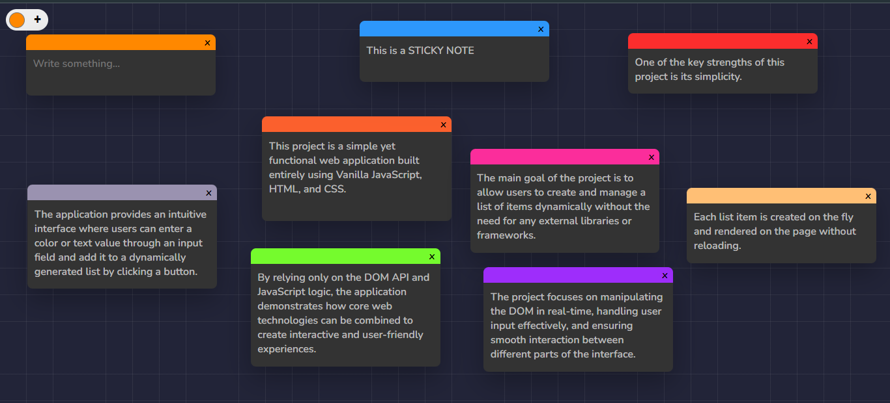

# 📝 Sticky Notes App

## 📖 Overview

The **Sticky Notes App** is a lightweight and interactive web application built with **Vanilla JavaScript**.  
It allows users to create, customize, drag, and delete sticky notes directly in the browser.

---

## 🚀 Features

- 🎨 **Custom Colors**: Choose a top border color for each note.
- 📝 **Resizable Textarea**: Textarea auto-expands while typing (no scrollbars).
- 📦 **Dynamic Creation**: Instantly add new notes with a single click.
- 🗑️ **Delete Notes**: Remove any note with the close button.
- 🖱️ **Drag & Drop**: Move notes freely across the screen with mouse drag.
- 🔝 **Z-Index Management**: The most recently moved note always stays on top.

---

## 🛠 Tech Stack

- **HTML5**
- **CSS3**
- **JavaScript (ES6+)**

---

## 📂 Project Structure

├── index.html # Main structure of the app  
├── style.css # Styling for notes and layout  
├── script.js # Core logic (create, delete, drag notes)  
└── README.md # Documentation

---

## 📸 Screenshots



---

## ⚙️ Installation & Setup

1. Clone the repository:
   ```bash
   git clone https://github.com/username/sticky-notes-app.git
   ```
2. Open the project folder.
3. Launch the app by opening `index.html` in your browser.

_(Optional: use Live Server for a smoother development experience)_

---

## 🎮 Usage

1.  Select a **color** from the input color picker.
2.  Click the **"Create Note"** button to generate a new note.
3.  Type inside the note — the textarea will expand automatically.
4.  Drag the note anywhere on the screen by holding the mouse.
5.  Delete unwanted notes using the **"x"** button.

---

## 📌 Code Highlights

- **Auto-expanding textarea**:

  `textArea.addEventListener("input", () => {
  textArea.style.height = textArea.scrollHeight + "px";
})`

- **Drag & Drop logic**:

  `document.addEventListener("mousemove", (e) => { if (note.dom === null) return; let distance = { x: e.clientX - cursor.x, y: e.clientY - cursor.y,
};
note.dom.style.left = note.x + distance.x + "px";
note.dom.style.top = note.y + distance.y + "px";`

---

## 📅 Future Improvements

- Add **localStorage support** to save notes between sessions.
- Add **resizing** for notes.
- Implement **mobile touch support**.
- Add **dark mode** theme.
